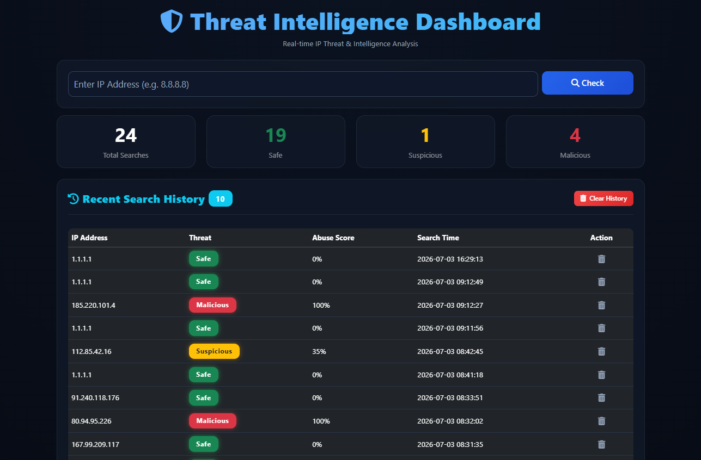
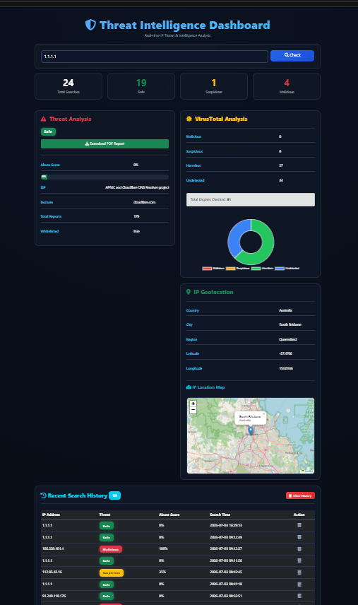

#  Threat Intelligence Dashboard

A real-time cybersecurity dashboard that analyzes IP addresses using multiple threat intelligence APIs. Designed as a SOC analyst-style utility to streamline digital infrastructure reconnaissance.

---

##  Project Highlights

✔ **Real-time Threat Intelligence System** — Aggregates indicators of compromise (IoCs) instantly.
✔ **SOC Analyst Style Dashboard** — Provides structured risk scoring and malware engine classifications.
✔ **API Integration Project** — Demonstrates robust multi-source asynchronous data fetching.
✔ **Cybersecurity Data Visualization** — Renders dynamic geographic maps and malware distribution charts.

---

##  Features

- IP Reputation Check (AbuseIPDB)
- VirusTotal Threat Analysis
- IP Geolocation Tracking
- Interactive Dashboard UI (Zero Map Fragmentation)
- Search History (SQLite)
- PDF Report Generation
- Data Visualization Charts (Chart.js)

---

##  Tech Stack

- **Backend:** Python (Flask)
- **Database:** SQLite
- **Frontend:** HTML, CSS (Glassmorphism), Bootstrap
- **Libraries:** JavaScript (Chart.js, Leaflet.js)
- **APIs:** AbuseIPDB, VirusTotal

---

##  Screenshots

## 📸 Screenshots




---

##  How to Run

```bash
git clone [https://github.com/maneesha119/Threat-Intelligence-Dashboard.git](https://github.com/maneesha119/Threat-Intelligence-Dashboard.git)
cd Threat-Intelligence-Dashboard
python -m venv .venv
# On Windows: .venv\Scripts\activate | On Mac/Linux: source .venv/bin/activate
pip install flask requests fpdf
python app.py


---

## Author
**Maneesha Sulakshana**